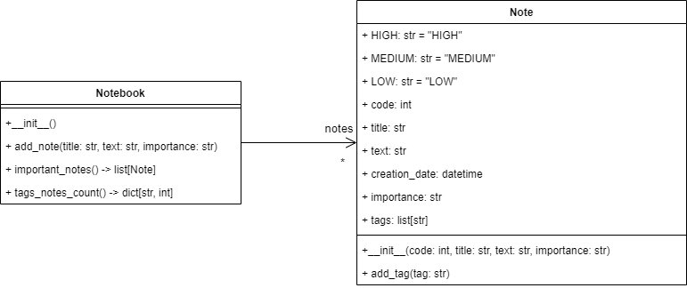

# Libreta de notas (Notebook)
Esta es una aplicación de práctica de conceptos de programación 
orientada a objetos en python, en la cual se quiere implementar 
una libreta de notas que permita:

- Agregar una nueva nota: Permite agregar una nueva nota indicando el título, el texto de la nota y la importancia 
(HIGH, MEDIUM,  LOW). El sistema le asigna un código único a cada nota.
- Listar todas las notas: Muestra todas las notas de libro de notas
- Agregar etiquetas a una nota: Permite agregar etiquetas a una nota, para esto se debe indicar el código de la nota y 
una lista de etiquetas separadas por coma.
- Listar las notas importantes: Lista todas las notas cuya importancia sea HIGH o MEDIUM
- Borrar una nota: Borra una nota del libro dado su código
- Mostrar el contador de notas: muestra un informe indicando cuántas notas hay por cada etiqueta que se haya creado.

El modelo del mundo del problema para dicha aplicación es el siguiente:




Implemente el modelo en el módulo notebook.py que se encuentre en el paquete notebook.model. Para la implementación, 
tenga en cuenta lo siguiente

1. Implemente la clase Note como una dataclass
2. Para la definición del atributo creation_time utilice el tipo `datetime` que viene en el módulo datetime que viene 
incluido en Python. Inicialice el atributo con la fecha actual, utilizando la función `field` de dataclasses,
específicamente el parámetro `default_factory`.
3. El atributo tags de la clase Note debe ser una lista de strings. Utilice la función `field` de dataclasses con su
parámetro `default_factory` para inicializar el atributo con una lista vacía.
4. La representación en string de una nota debe tener el siguiente formato

```
Code: <code>
Creation date: <creation date>
<title>: <text>
```
5. El método `add_tag` de la clase `Note` debe verificar que el tag no exista en la lista de tags antes de agregarlo.
6. El método `add_note` de la clase `Notebook` debe agregar una nueva nota, generando un código único para la nota. 
Debe retornar el código de la nota agregada.
7. El método `important_notes` debe retornar la lista de notas cuya importancia sea `HIGH` o `MEDIUM`.
8. En la clase `Notebook`, defina un método de instancia `tags_note_count` el cual retorna un diccionario donde las 
claves son de tipo `str` y los valores de tipo `int`. En el cuerpo del método implemente un algoritmo para construir
un diccionario que indique, por cada tag, cuántos objetos Note tienen dicho tag asignado.

**Nota: Debe utilizar pistas de tipos en todos los casos donde sea posible**